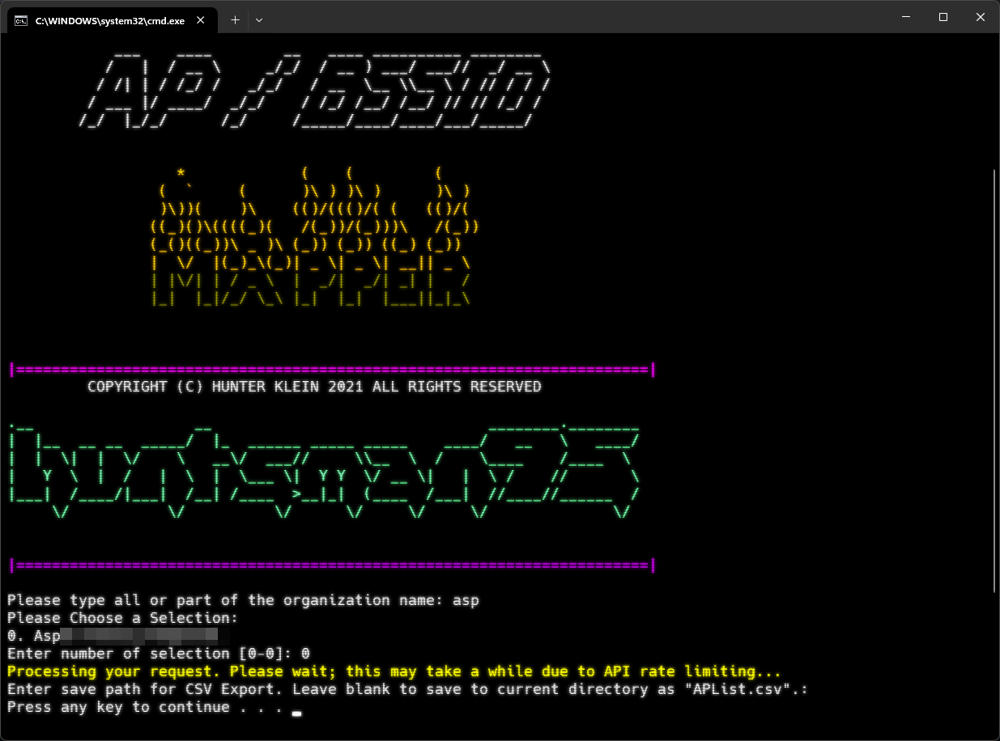

# Meraki BSSID Mapper

## Summary
This script serves as an easy way to generate a CSV export of all Access Points (APs) in your network along with their BSSIDs / SSIDs / misc other info.

## Usage
1. Download or clone the repo
2. Run `BSSID_Mapper.cmd` or `Main.ps1` if Execution Policy allows.
3. Enter API key when prompted
4. Search for your Organization
5. Select your Organization based on returned search results
6. When the script finishes running, you will be prompted to save the CSV file to your local machine. Just press enter to save it in the same directory as the script. The path you enter MUST have the filename in it (ex: `C:\path\out.csv`)

> [!CAUTION]
> You can save your api key in a .txt file in the same directory as the script labeled `apikey.txt`. This will allow you to run the script without having to enter your api key each time. Please note that the api key will be stored in plain text and it is only recommended for testing purposes.

## Screenshot

## Change Log
- v1.1: Added columns for SSID (ESSID) and LLDP/CDP info along with other metadata that could be useful.
- v1.0: Initial release